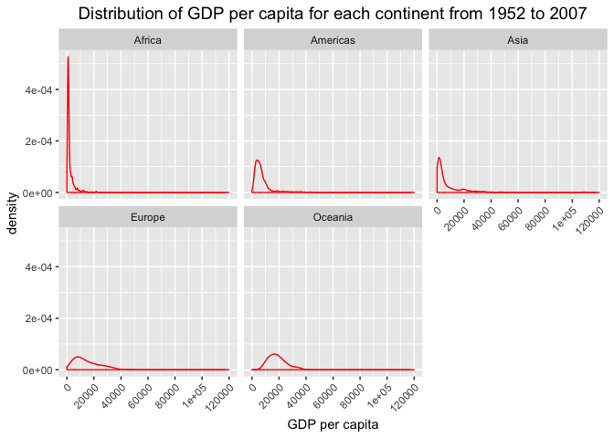

Homework 03: Use dplyr/ggplot2 to manipulate and explore data
================

## Overview

I will finish the following tasks in this assignment.

  - Get the maximum and minimum of GDP per capita for all continents.

  - Look at the spread of GDP per capita within the continents.

  - Compute a trimmed mean of life expectancy for different years.

  - How is life expectancy changing over time on different continents?

  - Report the absolute abundance of countries with low life expectancy
    over time by continent.

First we need to load `gapminder` dataset and `tidyverse` package and
`knitr` and `reshape2` package.

``` r
library(gapminder)
library(tidyverse)
```

    ## ── Attaching packages ───────────────────────────────────── tidyverse 1.2.1 ──

    ## ✔ ggplot2 3.0.0     ✔ purrr   0.2.5
    ## ✔ tibble  1.4.2     ✔ dplyr   0.7.6
    ## ✔ tidyr   0.8.1     ✔ stringr 1.3.1
    ## ✔ readr   1.1.1     ✔ forcats 0.3.0

    ## ── Conflicts ──────────────────────────────────────── tidyverse_conflicts() ──
    ## ✖ dplyr::filter() masks stats::filter()
    ## ✖ dplyr::lag()    masks stats::lag()

``` r
library(knitr)
library(reshape2)
```

    ## 
    ## Attaching package: 'reshape2'

    ## The following object is masked from 'package:tidyr':
    ## 
    ##     smiths

## Get the maximum and minimum of GDP per capita for all continents

I group the gapminder dataset by continent and then use summarize()
function where max() and min() are included to get the range of GDP per
capita for all continents.

``` r
a<-group_by(gapminder,continent)%>%
  summarize(max_gdpPercap=max(gdpPercap),min_gdpPercap=min(gdpPercap))
  kable(a)
```

| continent | max\_gdpPercap | min\_gdpPercap |
| :-------- | -------------: | -------------: |
| Africa    |       21951.21 |       241.1659 |
| Americas  |       42951.65 |      1201.6372 |
| Asia      |      113523.13 |       331.0000 |
| Europe    |       49357.19 |       973.5332 |
| Oceania   |       34435.37 |     10039.5956 |

I will plot maximum and minimum of GDP per capita for each continent
using bar chart.

``` r
# merge max_gdpPercap column and min_gdpPercap into one column 
b<-melt(a,id=c("continent"))
# use bar plot to compare max_gdpPercap with min_gdpPercap
ggplot(b,aes(x=continent,y=value,fill=variable))+
  geom_bar(position="dodge",stat="identity")+scale_y_log10()+
  theme(plot.title = element_text(size=14,hjust=0.5))+
  labs(x="continent",
       y="GDP per capita - log scale",
       title="maximum and minimum of GDP per capita for all continents")
```

<!-- -->

We can find out that there is big range bettween max GDP per capita and
min GDP per capita. Oceania has smallest range perhaps since only two
countries have been observed.

## Look at the spread of GDP per capita within the continents

First, we can look at the distribution of GDP per capita for each
continent from year 1952 to 2007.

``` r
p<-group_by(gapminder,continent)%>%
  summarize(max_gdpPercap=max(gdpPercap),
            min_gdpPercap=min(gdpPercap),
            mean_gdpPercap=mean(gdpPercap),
            median_gdpPercap=median(gdpPercap),
            sd_gdpPercap=sd(gdpPercap))
  kable(p)
```

| continent | max\_gdpPercap | min\_gdpPercap | mean\_gdpPercap | median\_gdpPercap | sd\_gdpPercap |
| :-------- | -------------: | -------------: | --------------: | ----------------: | ------------: |
| Africa    |       21951.21 |       241.1659 |        2193.755 |          1192.138 |      2827.930 |
| Americas  |       42951.65 |      1201.6372 |        7136.110 |          5465.510 |      6396.764 |
| Asia      |      113523.13 |       331.0000 |        7902.150 |          2646.787 |     14045.373 |
| Europe    |       49357.19 |       973.5332 |       14469.476 |         12081.749 |      9355.213 |
| Oceania   |       34435.37 |     10039.5956 |       18621.609 |         17983.304 |      6358.983 |

We can use density plot to visualize the distribution of GDP per capita
for each continent from year 1952 to 2007.

``` r
ggplot(gapminder,aes(x=gdpPercap))+
  geom_density(color='red')+
  facet_wrap(~continent)+
  scale_x_continuous(breaks = seq(0, 120000, 20000),
                     labels = as.character(seq(0, 120000, 20000)),
                     limits = c(0,120000))+
  theme(axis.text.x = element_text(angle = 45, hjust = 1),
        plot.title = element_text(size=14,hjust=0.5))+
  labs(x="GDP per capita",
       y="density",
       title="Distribution of GDP per capita for each continent from 1952 to 2007")
```

<!-- -->

Then I want to explore gdpPercap distribution for each continent in year
1952 and year 2007.

``` r
filter(gapminder,year %in% c(1952,2007))%>%
  group_by(continent,year)%>%
  summarize(mean_gdpPercap=mean(gdpPercap),
            median_gdpPercap=median(gdpPercap),
            sd_gdpPercap=sd(gdpPercap))%>%kable()
```

| continent | year | mean\_gdpPercap | median\_gdpPercap | sd\_gdpPercap |
| :-------- | ---: | --------------: | ----------------: | ------------: |
| Africa    | 1952 |        1252.572 |          987.0256 |      982.9521 |
| Africa    | 2007 |        3089.033 |         1452.2671 |     3618.1635 |
| Americas  | 1952 |        4079.063 |         3048.3029 |     3001.7275 |
| Americas  | 2007 |       11003.032 |         8948.1029 |     9713.2093 |
| Asia      | 1952 |        5195.484 |         1206.9479 |    18634.8909 |
| Asia      | 2007 |       12473.027 |         4471.0619 |    14154.9373 |
| Europe    | 1952 |        5661.057 |         5142.4697 |     3114.0605 |
| Europe    | 2007 |       25054.482 |        28054.0658 |    11800.3398 |
| Oceania   | 1952 |       10298.086 |        10298.0857 |      365.5601 |
| Oceania   | 2007 |       29810.188 |        29810.1883 |     6540.9911 |

Use histogram plot to visualize the distribution of GDP per capita for
each continent.

``` r
filter(gapminder,year %in% c(1952,2007))%>%
  ggplot(aes(x=gdpPercap))+
  geom_histogram(fill='blue',alpha=0.3,bins=45)+
  facet_grid(continent~year)+
  scale_x_continuous(breaks = seq(0, 60000, 10000),
                     labels = as.character(seq(0, 60000, 10000)),
                     limits = c(0,60000))+
  theme(axis.text.x = element_text(angle = 45, hjust = 1),
        plot.title = element_text(size=14,hjust=0.5))+
  labs(x="GDP per capita",
       y="number of countries",
       title="Distribution of GDP per capita for each continent in 1952 and 2007")
```

    ## Warning: Removed 1 rows containing non-finite values (stat_bin).

<!-- -->

## Compute a trimmed mean of life expectancy for different years

I want to compute a trimmed mean of life expectancy for each year.

``` r
d<-group_by(gapminder,year)%>%
  filter(lifeExp > (mean(lifeExp)-sd(lifeExp)) & 
         lifeExp < (mean(lifeExp)+sd(lifeExp)))%>% #remove data beyond 1 standard deviation
         summarize(mean_lifeExp=mean(lifeExp),
                   median_lifeExp=median(lifeExp),
                   sd_lifeExp=sd(lifeExp))
kable(d)
```

| year | mean\_lifeExp | median\_lifeExp | sd\_lifeExp |
| ---: | ------------: | --------------: | ----------: |
| 1952 |      46.46188 |         43.7435 |    7.427987 |
| 1957 |      48.88023 |         45.9740 |    7.452482 |
| 1962 |      51.82732 |         49.2105 |    7.503463 |
| 1967 |      54.20508 |         52.0400 |    7.064964 |
| 1972 |      57.06164 |         55.6350 |    6.613370 |
| 1977 |      60.53702 |         59.8370 |    6.951729 |
| 1982 |      62.76019 |         62.8700 |    6.406471 |
| 1987 |      64.65873 |         65.8690 |    5.901298 |
| 1992 |      66.20204 |         68.0150 |    6.129149 |
| 1997 |      67.66955 |         69.7200 |    6.561805 |
| 2002 |      69.11620 |         71.0170 |    6.853376 |
| 2007 |      70.39740 |         72.4360 |    6.642209 |

Now I want to use histogram to visualize data.

``` r
group_by(gapminder,year)%>%
  filter(lifeExp > (mean(lifeExp)-sd(lifeExp)) & 
         lifeExp < (mean(lifeExp)+sd(lifeExp)))%>% #remove data beyond 1 standard deviation
  ggplot(aes(x=lifeExp))+
  geom_histogram(fill='red',alpha=0.5)+
  facet_wrap(~year)+
  theme(plot.title = element_text(size=14,hjust=0.5))+
  labs(x="life expectancy",
       y="number of countries",
       title="Distribution of Life Expectancy from 1952 to 2007")
```

    ## `stat_bin()` using `bins = 30`. Pick better value with `binwidth`.

<!-- -->

Next I want to see the trend of trimmed mean of life expectancy over
time.

``` r
ggplot(d,aes(x=year,y=d$mean_lifeExp))+
  geom_point(color='red',alpha=0.5)+
  geom_line()+
  scale_x_continuous(limits=c(1952,2007),breaks=seq(1952,2007,5))+
  theme(plot.title = element_text(size=14,hjust=0.5))+
  labs(x="year",
       y="trimmed mean of life expectancy",
       title="Trimmed mean of life expectancy from 1952 to 2007")
```

<!-- -->

## How is life expectancy changing over time on different continents?

I want to explore life expectancy changing over different periods for
all
continents.

``` r
e<-mutate(gapminder, period = paste(substr(year,1,3),"0s",sep="",collapse = NULL))
l<-group_by(e,continent,period)%>%
  summarize(mean_lifeExp=mean(lifeExp),
            median_lifeExp=median(lifeExp),
            sd_lifeExp=sd(lifeExp))
filter(l,continent %in% c("Americas","Africa"))%>%kable()#just show data for Americas and Africa
```

| continent | period | mean\_lifeExp | median\_lifeExp | sd\_lifeExp |
| :-------- | :----- | ------------: | --------------: | ----------: |
| Africa    | 1950s  |      40.20092 |         39.9890 |    5.470491 |
| Africa    | 1960s  |      44.32699 |         43.9890 |    6.036326 |
| Africa    | 1970s  |      48.51568 |         48.1205 |    6.669317 |
| Africa    | 1980s  |      52.46883 |         51.5220 |    7.637712 |
| Africa    | 1990s  |      53.61392 |         52.6000 |    9.238787 |
| Africa    | 2000s  |      54.06563 |         52.4060 |    9.590806 |
| Americas  | 1950s  |      54.62006 |         55.1540 |    9.186941 |
| Americas  | 1960s  |      59.40484 |         60.3165 |    8.190806 |
| Americas  | 1970s  |      63.39324 |         65.3720 |    7.194579 |
| Americas  | 1980s  |      67.15978 |         68.1625 |    6.284578 |
| Americas  | 1990s  |      70.35942 |         70.7315 |    5.041435 |
| Americas  | 2000s  |      73.01508 |         72.8275 |    4.615425 |

Then I want to explore which country has longest life expectancy for
each continent from 1952 to 2007.

``` r
group_by(e,continent,period)%>%
  arrange(desc(lifeExp))%>%
  summarize(country=first(country))%>%
  filter(continent=="Asia"| continent=="Africa")%>% # just show data of Asia and Africa
  kable()
```

| continent | period | country   |
| :-------- | :----- | :-------- |
| Africa    | 1950s  | Mauritius |
| Africa    | 1960s  | Mauritius |
| Africa    | 1970s  | Reunion   |
| Africa    | 1980s  | Reunion   |
| Africa    | 1990s  | Reunion   |
| Africa    | 2000s  | Reunion   |
| Asia      | 1950s  | Israel    |
| Asia      | 1960s  | Japan     |
| Asia      | 1970s  | Japan     |
| Asia      | 1980s  | Japan     |
| Asia      | 1990s  | Japan     |
| Asia      | 2000s  | Japan     |

Finally, I will plot life expectancy of all continents over years.

``` r
ggplot(gapminder,aes(x=year,y=lifeExp))+
  geom_point(color='red',alpha=0.5)+
  geom_smooth(se=FALSE)+
  facet_wrap(~continent,nrow=2)+
  scale_x_continuous(breaks = seq(1950, 2010, 10),
                     labels = as.character(seq(1950, 2010, 10)),
                     limits = c(1950, 2010))+
  theme(axis.text.x = element_text(angle = 45, hjust = 1),
        plot.title = element_text(size=14,hjust=0.5))+
  labs(x="year",
       y="life expectancy",
       title="life expectancy of all continents over time")
```

    ## `geom_smooth()` using method = 'loess' and formula 'y ~ x'

<!-- -->

## Report the absolute abundance of countries with low life expectancy over time by continent

First we need to compute worldwide low life expectancy for each year.
low life expectancy = average life expectancy - standard deviation of
life expectancy.

``` r
group_by(gapminder,year)%>%
  summarize(low_life_expectancy=mean(lifeExp)-sd(lifeExp))%>%kable()
```

| year | low\_life\_expectancy |
| ---: | --------------------: |
| 1952 |              36.83166 |
| 1957 |              39.27611 |
| 1962 |              41.51200 |
| 1967 |              43.95943 |
| 1972 |              46.26543 |
| 1977 |              48.34293 |
| 1982 |              50.76258 |
| 1987 |              52.65633 |
| 1992 |              52.93296 |
| 1997 |              53.45524 |
| 2002 |              53.41510 |
| 2007 |              54.93440 |

Next I will compute how many countries on each continent have a life
expectancy less than low life expectancy.

``` r
f<-group_by(gapminder,year)%>%
  mutate(lowLifeExp=mean(lifeExp)-sd(lifeExp)) #determine low life expectancy for each year
g<-group_by(f,continent,year)%>%
  summarize(numBelowLowLifeExp=sum(lifeExp<lowLifeExp))
filter(g,continent == "Africa")%>%kable() #this produces a long table, I will only output data for Africa as an example
```

| continent | year | numBelowLowLifeExp |
| :-------- | ---: | -----------------: |
| Africa    | 1952 |                 17 |
| Africa    | 1957 |                 19 |
| Africa    | 1962 |                 22 |
| Africa    | 1967 |                 23 |
| Africa    | 1972 |                 25 |
| Africa    | 1977 |                 24 |
| Africa    | 1982 |                 26 |
| Africa    | 1987 |                 28 |
| Africa    | 1992 |                 27 |
| Africa    | 1997 |                 29 |
| Africa    | 2002 |                 31 |
| Africa    | 2007 |                 30 |

Finally I will plot this using scatter plot and line plot.

``` r
ggplot(g,aes(x=year,y=numBelowLowLifeExp))+
  geom_point(color='red',alpha=0.5)+
  geom_line()+
  facet_wrap(~continent)+
  scale_x_continuous(breaks = seq(1950, 2010, 10),
                     labels = as.character(seq(1950, 2010, 10)),
                     limits = c(1950, 2010))+
  theme(axis.text.x = element_text(angle = 45, hjust = 1),
        plot.title = element_text(size=14,hjust=0.5))+
  labs(x="year",
       y="number of countries below low life expectancy",
       title="Absolute abundance of countries with low life expectancy over time")
```

<!-- -->

We can find that Africa has the most countries with low life expectancy,
and it even has an increasing tendency over time.
